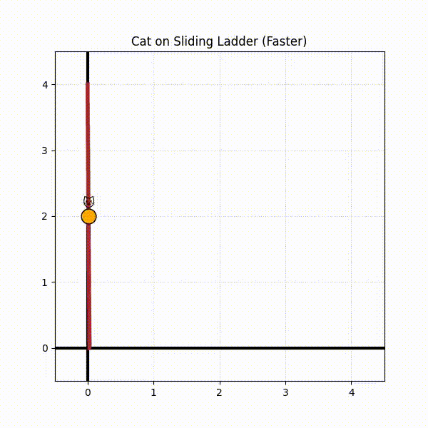
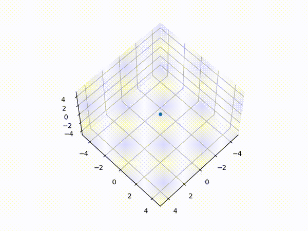
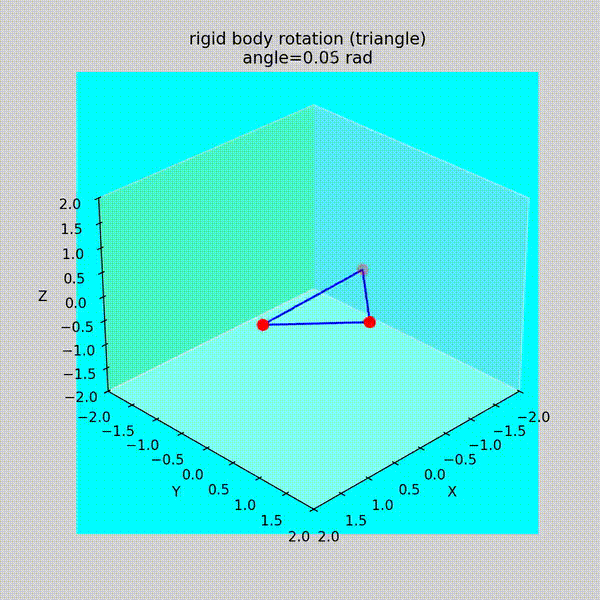
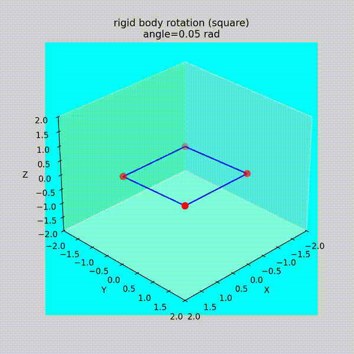
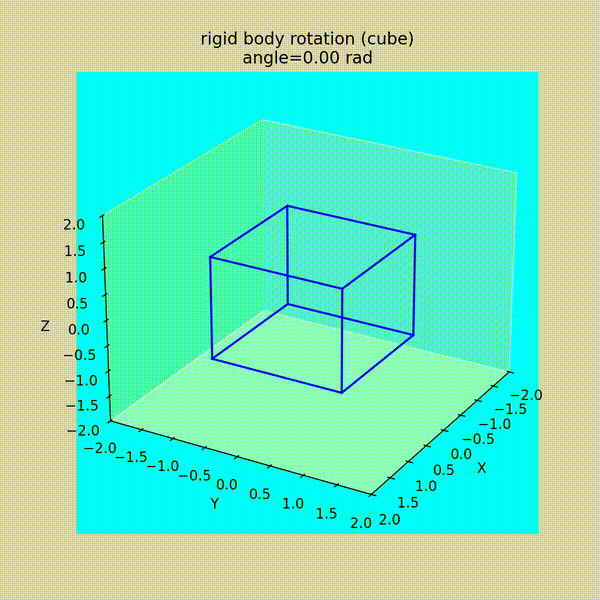

# Python Mathematical Animation


A collection of **mathematical animations built with Python** to help students visualize mathematical concepts using **geometry, linear algebra, and transformations**.

This project demonstrates how mathematical ideas can be turned into **dynamic visual animations** using libraries such as **NumPy and Matplotlib**.

The focus of this repository is **learning mathematics through visualization** and understanding how mathematical transformations produce motion.

---

# Project Goals

This project aims to help students understand:

* Mathematical visualization
* Coordinate geometry
* Linear transformations
* Rotation matrices
* Parametric motion
* 2D and 3D animation principles

Instead of treating animation as a graphics trick, the project approaches animation as a **mathematical transformation problem**.

---

# Demo Animations

## 2D Animation

### Cat Ladder Animation

A classical geometric construction visualized dynamically.



---

## 3D Animations

### Changing Camera Angle

Demonstrates the difference between **camera motion** and **object motion**.



---

### Rotating Triangle

A triangle rotating using a **rotation matrix**.



---

### Rotating Square

A square rotating around the **x-axis**.



---

### Rotating Cube

A cube rotating using **combined 3D transformations**.



---

# Mathematical Idea Behind the Animations

Most animations in this project are based on **linear algebra transformations**.

Example transformation:

```
P' = R @ P
```

Where

* `P` = original coordinates
* `R` = transformation matrix
* `P'` = transformed coordinates

For example, a rotation around the z-axis is given by

```
Rz(θ) = [[cosθ  -sinθ  0]
         [sinθ   cosθ  0]
         [0        0   1]]
```

Applying this matrix rotates every point of an object simultaneously.

---

# Repository Structure

```
.
├── 2d-anim
│   ├── notebooks
│   ├── scripts
│   └── assets
│       ├── gifs
│       └── videos
│
├── 3d-anim
│   ├── notebooks
│   ├── scripts
│   └── assets
│       ├── gifs
│       └── videos
```

# Installation

This project uses **uv** for Python environment and dependency management.

Install uv (if not installed):

```bash
pip install uv
```

Clone the repository:

```bash
git clone https://github.com/<your-username>/Python-Mathematical-Animation.git
cd Python-Mathematical-Animation
```

Install dependencies using uv:

```bash
uv sync
```

This command will:

* create the virtual environment
* install dependencies from `pyproject.toml`

---

# Running Examples

Run scripts using uv:

```bash
uv run python 3d-anim/scripts/object_rotation.py
```

Example:

```bash
uv run python 3d-anim/scripts/rotating_camera.py
```

To open notebooks:

```bash
uv run jupyter lab
```

---

# Author

Shubham Tiwari

B.Sc. Mathematics (Hons)

Dyal Singh College

University of Delhi

---

# License

This project will be released under the **MIT License**.
